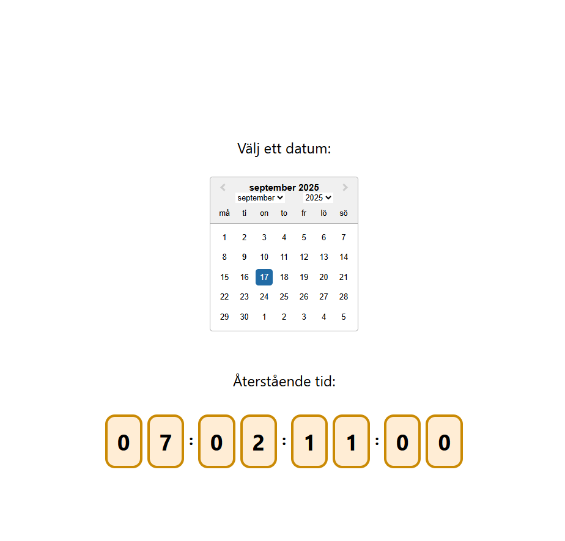

# DateCounter

This is a small project I've been doing for fun. I started to import reacts datePicker and added month and year to it. Then I dded this counter that will pop up, after a date i selected. The counter shows in days, hours, minutes and seconds.

As I said. Just a samll project and this project can go even further to something bigger.

